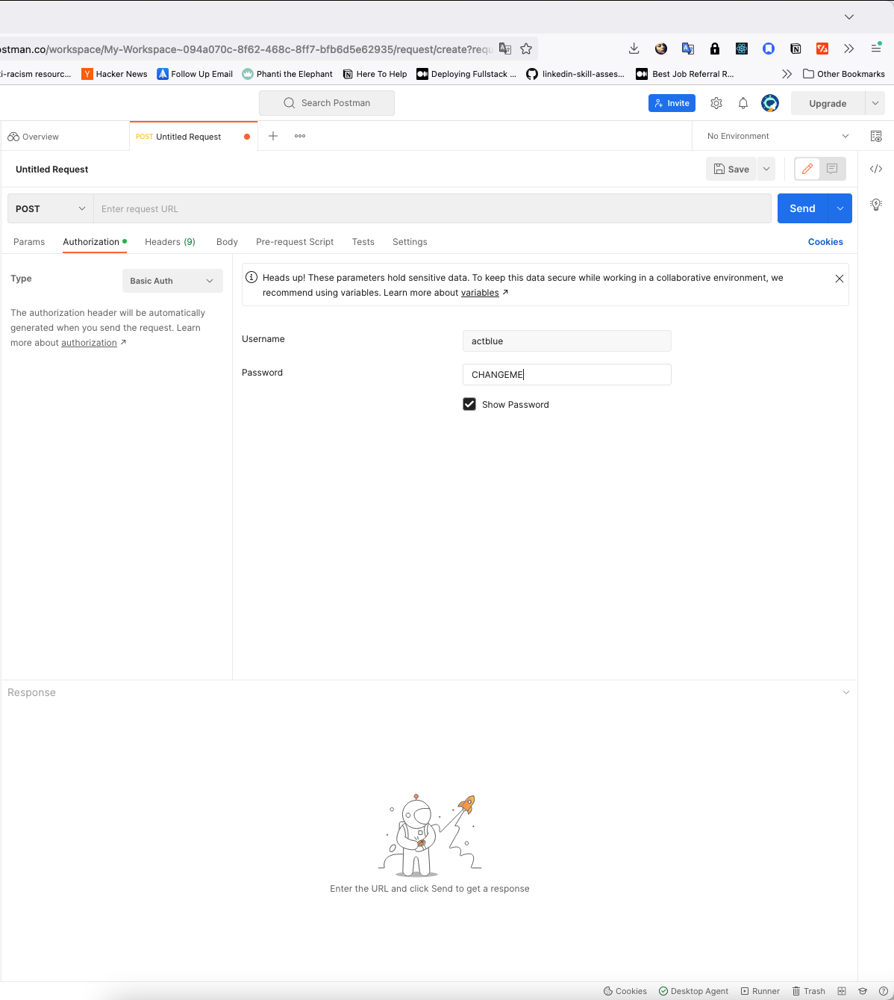
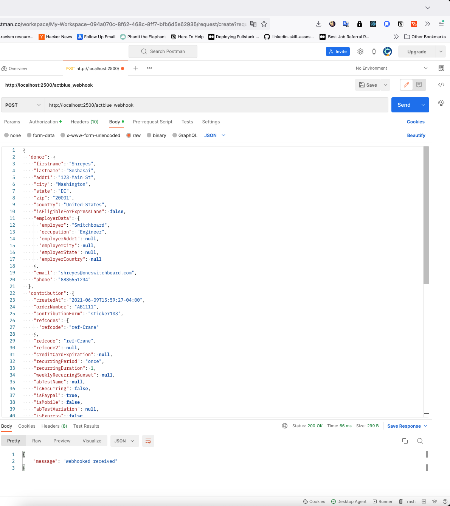

# <div id="top"></div>

<!--
*** Thanks for checking out the Best-README-Template. If you have a suggestion
*** that would make this better, please fork the repo and create a pull request
*** or simply open an issue with the tag "enhancement".
*** Don't forget to give the project a star!
*** Thanks again! Now go create something AMAZING! :D
-->

<!-- PROJECT SHIELDS -->
<!--
*** I'm using markdown "reference style" links for readability.
*** Reference links are enclosed in brackets [ ] instead of parentheses ( ).
*** See the bottom of this document for the declaration of the reference variables
*** for contributors-url, forks-url, etc. This is an optional, concise syntax you may use.
*** https://www.markdownguide.org/basic-syntax/#reference-style-links
-->

<!-- TABLE OF CONTENTS -->
<details>
  <summary>Table of Contents</summary>
  <ol>
    <li>
      <a href="#about-the-project">About The Project</a>
      <ul>
        <li><a href="#built-with">Built With</a></li>
      </ul>
    </li>
    <li>
      <a href="#getting-started">Getting Started</a>
      <ul>
        <li><a href="#prerequisites">Prerequisites</a></li>
        <li><a href="#installation">Installation</a></li>
      </ul>
    </li>
    <li><a href="#usage">Usage</a></li>
  </ol>
</details>

<!-- ABOUT THE PROJECT -->

### Built With

- [React.js](https://reactjs.org/) with [Vite](https://vitejs.dev/)
- [React Query v.3](https://react-query-v3.tanstack.com/)
- [React Table v.7](https://react-table-v7.tanstack.com/)
- [Node.js](https://nodejs.org/en/) + [Express.js](https://expressjs.com/)
- [MongoDB Atlas](https://www.mongodb.com/)
- [Mongoose.js](https://mongoosejs.com/)

<p align="right">(<a href="#top">back to top</a>)</p>

<!-- GETTING STARTED -->

## Getting Started

To get a local copy up and running follow these simple example steps.

### Prerequisites

This project was created with `yarn@3.2.2`, please ensure you're using the correct yarn version

- install yarn if you don't have it
  ```sh
  npm install -g yarn
  ```
- go into this project and run
  ```sh
  yarn set version berry
  ```

### Installation

1. Clone the repo
   ```sh
   git clone https://github.com/emmebravo/switchboard.git
   ```
2. Install NPM packages

   ```sh
   yarn install
   ```

3. To run the server

   ```sh
   yarn dev
   ```

4. To run the client, make sure you're in the right folder
   ```sh
   cd client
   yarn dev
   ```

### IMPORTANT

- The frontend and backend are **not** running concurrently
- I've done two things which are vulnerabilities, but I felt necessary to make running this repo as smooth as possible.
  1.  I've included the `mongodb` connection string in the `config/database.js` file as I've seeded the CSV data already.
  2.  The `USERNAME` & `PASSWORD` for `express-basic-auth` used in the `/actblue_webhook` endpoint are not hidden, either
      - they're the same as the APPENDIX A username & password

<p align="right">(<a href="#top">back to top</a>)</p>

<!-- USAGE EXAMPLES -->

## Up & Running

- Server can be the only one running to send a `POST` request to the `/actblue_webhook` endpoint
- React will not display the data unless the server is running
  - they aren't running concurrently, sorry!

### Webhook `POST` Request

- the webhook `post` endpoint is not accessible via React. I treated it as if it was only accessible by an actual service sending a webhook
- it was tested with Postman's API:

  <a href="https://github.com/emmebravo/switchboard">
    
  </a>

    <a href="https://github.com/emmebravo/switchboard">
    
  </a>

<p align="right">(<a href="#top">back to top</a>)</p>
